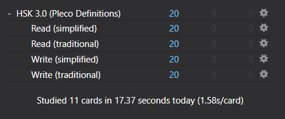
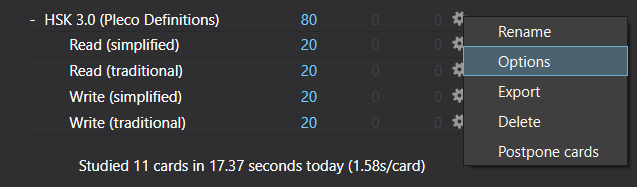
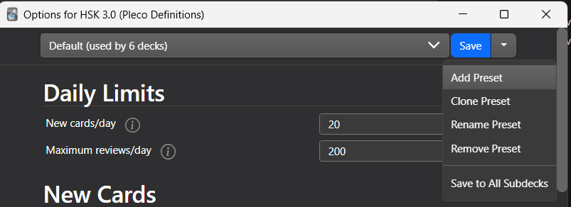
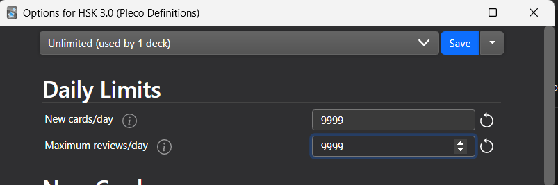

# Pleco Anki

Hello! This is a project for specifically learning Chinese Vocabulary via [Pleco](https://www.pleco.com/) and [Anki](https://apps.ankiweb.net/)!

[Skip to Download & Setup](#using-anki-and-the-generated-deck)

## Intro to Pleco and Anki & Motivations for this Project

For some quick background, Pleco is a widely used Chinese-English dictionary app that is very popular and contains a lot of useful tooling and resources for looking up English translations of Chinese words and phrases. One thing that Pleco does really well, is that there are a large variety of example sentences for most word definitions, giving good context into how a word should be used. (sometimes the examples are a pain to understand but usually they are pretty good)

Anki is a spaced reptition flashcard app that is very supported and widely used. The most common use case is for medical students trying to memorize all medical knowledge under the sun, but a great deal of people also use it for learning languages. Spaced repitition means that as you learn the various flash cards in your deck, it will adjust the interval/frequency you see the flash card based on how often you get the answer to the card. For example if you just learned a new word, it will show it to you 10 minutes after you get it correct; if you get it right again it will come back 1 day later; correct again 3 days later; correct again 6 days later; wrong you get it again in a few minutes, and after geting it correct it comes back tomorrow. For me this really solves the problem of learning a Chinese phrase for a month/limited period of time, but never remembering it. Do note that consistency is key, ideally you do this everyday but if you skip too much you end up having 900 cards due and the space repitition is definitely less useful then.

Anki is pretty flexible, so you can create your own flashcards for whatever topic you can think of and you can find a lot of user made flash card decks online. For Chinese, however I couldn't find a deck with good example sentences, most definitions in Anki decks use [CC-CEDICT](https://www.mdbg.net/chinese/dictionary?page=cc-cedict) or something similar which is okay, but I didn't like the lack of example sentences and lack of parts of speech. Also many decks are based on the [Hanyu Shuiping Kaoshi](https://en.wikipedia.org/wiki/Hanyu_Shuiping_Kaoshi) (HSK) Chinese literacy word list, but the one I initially started using dropped half the words randomly! At the end of the day I was tired of having an incomplete deck and definitions that weren't up to par. 

This project was to build an Anki Deck based on the new HSK 3.0 wordlist released in 2021 using definitions from Pleco. Pleco has their own flashcard system and on Android there is even an option to generate an Anki Flashcard for any given phrase (if you pay $10 for the extension). Only issue was there is no way to programmatically create flashcards for a long set of words (around 11k), the only option for creating flashcards was manually searching up the words in Pleco, and clicking the **\<create flashcard\>** button. Thus the project was born.

1. Emulate Android via BlueStacks and download Pleco + AnkiDroid
2. Write an AutoHotKey script to manually search/click through 11k HSK 3.0 words
3. Discover that due to lag & timing errors you're missing ~2k words
4. Load exported Anki Decks as a Sqlite Database (with much help from the [ankidroid schema](https://github.com/ankidroid/Anki-Android/wiki/Database-Structure)) to identify missing words
5. Backfill missing ~2k words
6. Run a second backfill since words are still missing
7. Write a script to format and generate meta data for each card (ie. add hsk level tags)

And voila, now you have a beautiful working, Anki Deck of HSK 3.0 words with Pleco definitions.

## Using Anki and the Generated Deck

1. Get the latest Apkg file from [this repo's Releases section](https://github.com/darren-huang/pleco_anki/releases)
1. Make an [AnkiWeb account](https://ankiweb.net) and get either the [Desktop Anki Client](https://apps.ankiweb.net/) and maybe the apps for Android or IOS (note: the official app for IOS not free (far from free its 24.99) but I think free versions are available, you should google it). You'll want the desktop client for sure to setup your decks
1. From the desktop app use the **\[Import Files\]** button to import the Apkg file
1. You're now good to go! Click a deck to practice writing/reading & select "again" if you got it wrong, and "hard/good/easy" if you got it correct. Anki will naturally resurface old cards based on how well you did on them and when you last saw them. Doing the cards daily makes best use of [Anki's spaced reptition learning](https://docs.ankiweb.net/background.html#spaced-repetition). Good luck!

## Extra: Editting Some Settings
- Editting How Many New Cards Per Day:

    By default Anki sets each deck to max 20 new cards a day. A slightly annoying piece is that since all 4 sub-decks (reading/writing) are put under 1 main deck called "HSK 3.0 (Pleco Definitions)", the 20 limit for the main deck messes with the limits for all the sub-decks. I like to fix this by setting the new card limit of the main deck to 9999 (essentially unlimited). The following steps are for how to do that, but you can do something similar to change the new card limits for any of the subdecks:

    1. If you click the \[HSK 3.0 (Pleco Definitions)\] deck it will show you all the subdecks:

        

        There a subdecks for learning to read (shows a word, back has pinyin + definition) and for writing 
        (shows definition with word missing, back has definition with the word). And also corresponding simplified
        and traditional versions. If you don't want the simplified or traditional versions, you can click the gear
        icon and select 'Delete' for that subdeck.

    1. Click on the gear icon next to the \[HSK 3.0 (Pleco Definitions)\] and select 'Options'

        

    1. Then click the drop-down next to the 'Save' button and add a new settings preset 

        

    1. Name it something like 'Unlimited' and set the 'New cards/day' and 'Maximum review/day' to 9999

        
        
        These setting presets control how many cards you'll get each day as well as adjust the intervals for
        seeing the card again after getting it right/wrong. You can play with the settings for the individual
        read/write subdecks, but for the main HSK 3.0 deck the daily limit does some weird stuff so setting
        the limit to something really high should fix that.
    
    1. After you save you should be all good to go!

- Change New vs. Old Card ordering

  By defualt Anki will mix old cards you're reviewing with new cards to learn. I usually don't like this since new cards take a long time, and I feel like its more important to finish reviewing old cards first before moving onto something new. To change this:
    1. a setting I would recommend changing is Preferences>Scheduling> change 'Mix new & review' to 'Show new after review'

- Remove Easy Cards (if you already know a good number of words)
    1. if hsk_level_1 etc. cards are too easy, on Anki desktop you can click 'Browse' and filter for hsk_level_1 and delete/suspend those cards

## Using the Code

If you want to do anything similar or would like to make your own custom anki collections this is a great place to get started.

### Auto Hot Key

Under the filder `auto_hotkey_scripts` you can find `pleco_populate.ahk` the script defines functions for writing some mouse cursor positions to `mouse_positions.ini` and then clicking in those mouse positions in a very specific order and timing. It also reads text line by line from `backfil_todo_wordlist_file.txt`.

### Python Scripts For Editting Anki APKGs

Anki Apkg's under the hood are just zipped sqlite databases. You can find some pretty up to date sqlite schema for apkgs [here](https://github.com/ankidroid/Anki-Android/wiki/Database-Structure) which is a big help. All the code for processing the chinese words, comparing against the HSK 3.0 wordlist, and editting the Anki Decks is inside `DirectlyEditAnkiDecks.ipynb`. (note if you are trying to edit the decks, don't be fooled by the packages on pypi for anki. They all don't work... They probably worked with older versions of Anki, but no more. Sqlite is the way to go. This will definitely save you many hours and headaches.). 
